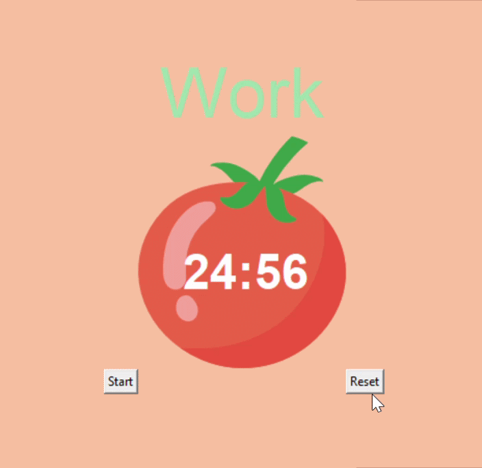

🍅 Pomodoro Timer – Python GUI Application
A Pomodoro timer application built with Python and Tkinter to practice GUI development and productivity concepts.

This project was developed during my 100 Days of Code journey while exploring dynamic typing and building interactive desktop applications.

🧠 Concept Overview

The Pomodoro Technique is a time-management method based on structured focus intervals:

25-minute focused work session

5-minute short break

Longer break after multiple sessions

This application programmatically manages those cycles using Tkinter’s event loop and timed callbacks.

⚙️ Technical Implementation

This project demonstrates:

Tkinter GUI layout management

Event-driven programming using after() for countdown scheduling

Dynamic typing in Python

Use of *args and **kwargs

State tracking across work/break sessions

Countdown logic with automatic session switching

The timer updates the interface in real time and transitions between sessions without blocking the main application loop.

🏗️ Project Structure
pomodoro-timer-python/
│
├── main.py
├── media/
│   └── preview.gif
└── README.md

▶️ Running the Application

Clone the repository

Ensure Python 3 is installed

Run:

python main.py

No external dependencies are required beyond Python’s standard library.
